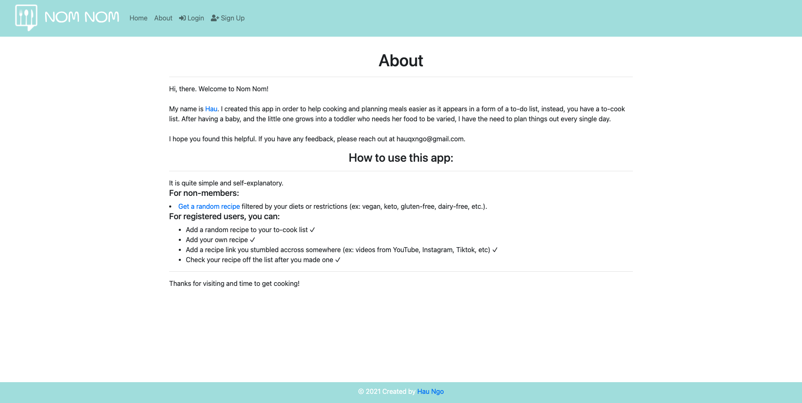

# NOM NOM

## Table of Contents
- [About](#about)
- [Features](#features)
  - [Navigation bar](#navigation-bar)
  - [Footer](#footer)
  - [How to use](#how-to-use)
- [User Flows](#user-flows)
- [API](#api)
- [Technology Stack Used](#technology-stack-used)
  - [Front-end](#front-end)
  - [Back-end](#back-end)
  - [Database](#database)
- [Screenshots](#screenshots)

## About
This is my first Capstone Project at Springboard Bootcamp. A full-stack app that can help users quickly get a random recipe to cook for their next meal or plan their weekly menu in a to-cook list.

## Features
### Navigation bar
- Navigation bar is visible on the top of each pages. It is responsive and will adapt to different devices.
- Navigation scheme:
  - On the left side is the site's logo. It can also be used to navigate to the Homepage.
  - On the right side is the collapse burger menu. It contains 4 pages if not registed:
    - Home
    - About
    - Login
    - Sign Up
  - After registered and logged in, there will be 5 pages on the navigation bar:
    - Home
    - About
    - To-cook List
    - Settings
    - Logout 

### Footer
Footer is consistent on all pages. It has Copyright symbol and link to my portfolio.

### How to use:
- For non-members:
  - Get a random recipe filtered by your diets or restrictions (ex: vegan, keto, gluten-free, dairy-free, etc.).
- For registered users:
  - Add a random recipe to your to-cook list ✓
  - Add your own recipe ✓
  - Add a recipe link you stumbled accross somewhere (ex: videos from YouTube, Instagram, Tiktok, etc) ✓
  - Check your recipe off the list after you made one ✓

## User Flows
- Users do not need to register to use the app. They can get a random recipe based on diets or restrictions right on the homepage.
- If registered, users will have a to-cook list. They can add a random recipe or add their own to the list, and check it off when they're done with that recipe.

## API
[spoonacular API](https://spoonacular.com/food-api/docs)

## Technology Stack Used
### Front-end:
- HTML
- CSS
- JavaScript
- Bootstrap
- Font Awesome
### Back-end:
- Python
- Flask
- SQLAlchemy
- WTForms
- Bcrypt
### Database:
- PostgreSQL

## Screenshots
### Before logging in:

### After logging in:

